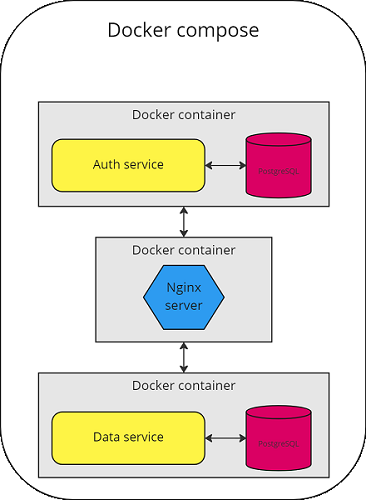

# Post_viewer Server app

Server application for processing requests from clients.
It is implemented in the Dart language using the Conduit framework.
___
## Application structure

___
## Technical description

Dart 2.18.6

Auth service is responsible for siging in/up and receiving Jwt tokens. Also refresh tokens are supported.

Data service is responsible for operations with user posts (creating, deleting, etc).

Both services use their own database.

Both services are not available from outside, and Nginx server proxies requests to them, listening on port 80.

___
## Useful links
[Conduit](https://www.theconduit.dev/)

___

*NOTE* since this project is a pet project, cases of overengineering are possible

